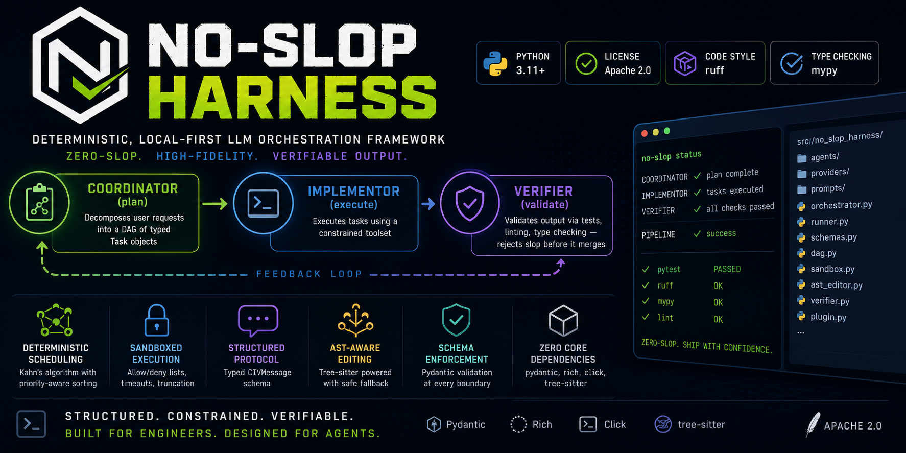

<p align="center">
  
</p>

# No-Slop Harness

[](https://www.python.org/downloads/)
[](LICENSE)
[](https://github.com/iknowkungfubar/no-slop-harness/actions/workflows/ci.yml)
[](https://github.com/astral-sh/ruff)
[](https://mypy-lang.org/)

**Deterministic, local-first LLM orchestration framework implementing the CIV (Coordinator-Implementor-Verifier) pattern for zero-slop, high-fidelity software engineering.**

## Overview

No-Slop Harness is an agentic framework that enforces structured, verifiable LLM workflows. It rejects the "black-box agent" model in favor of a **three-phase pipeline** where each phase has explicit constraints, validated schemas, and deterministic handoffs.

### The CIV Pattern

```
┌─────────────┐     ┌─────────────┐     ┌─────────────┐
│ Coordinator │ ──▶ │ Implementor │ ──▶ │  Verifier   │
│   (plan)    │     │  (execute)  │     │  (validate) │
└─────────────┘     └─────────────┘     └─────────────┘
       │                                       │
       └─────────── feedback loop ─────────────┘
```

- **Coordinator**: Decomposes user requests into a DAG of typed `Task` objects
- **Implementor**: Executes tasks using a constrained toolset (`read_file`, `write_file`, `edit_file_ast`, `bash_execute`)
- **Verifier**: Validates output via tests, linting, type checking — rejects slop before it merges

### Key Features

- **Deterministic scheduling** — Kahn's algorithm with priority-aware topological sort
- **Sandboxed execution** — command allowlisting, blocklisting, timeout enforcement, output truncation
- **Structured inter-agent protocol** — `CIVMessage` schema enforces typed communication between phases
- **AST-aware editing** — tree-sitter powered code modifications with syntax validation fallback
- **Pydantic schema enforcement** — every tool call, task, and message is validated at the boundary
- **Zero external dependencies for core** — only pydantic, rich, click, tree-sitter

## Quick Start

### Installation

**Recommended: pipx** (isolated, works on all distros including Arch, Debian 12+, Ubuntu 24.04+, Fedora)

```bash
# Install pipx if you don't have it
sudo pacman -S pipx        # Arch
sudo apt install pipx       # Debian/Ubuntu
sudo dnf install pipx       # Fedora

# Install from GitHub
pipx install git+https://github.com/iknowkungfubar/no-slop-harness.git

# Or with inference support (adds httpx for LLM API calls)
pipx install git+https://github.com/iknowkungfubar/no-slop-harness.git[inference]
```

**uv** (fast, modern, venv-based)

```bash
uv tool install git+https://github.com/iknowkungfubar/no-slop-harness.git[inference]
```

**venv** (traditional, works everywhere)

```bash
python -m venv .venv
source .venv/bin/activate
pip install no-slop-harness[inference]
```

**From PyPI (recommended):**

```bash
pip install no-slop-harness
```

**With LLM inference support:**

```bash
pip install "no-slop-harness[inference]"
```

**pipx (isolated global install):**

```bash
pipx install "no-slop-harness[inference]"
```

**Extras reference:**

| Extra | Adds | Size |
|-------|------|------|
| *(none)* | Core: schemas, orchestration, CLI, verifier, plugin system | ~5MB |
| `[inference]` | `httpx` — OpenAI-compatible LLM API client | +3MB |
| `[dev]` | pytest, ruff, mypy — development tools | +15MB |

### Basic Usage

```bash
# Initialize a pipeline session
no-slop init --sandbox-allowlist echo --sandbox-allowlist python

# Check pipeline status
no-slop status
```

### Programmatic Usage

**Synchronous (core only):**

```python
from no_slop_harness.orchestrator import PipelineOrchestrator
from no_slop_harness.schemas import Task, SandboxConfig

sandbox = SandboxConfig(
    allowed_commands=["echo", "python", "pytest"],
    timeout_seconds=120,
)

pipeline = PipelineOrchestrator(sandbox_config=sandbox)

tasks = [
    Task(task_id="add_model", description="Create User model", action="Add SQLAlchemy model"),
    Task(task_id="add_tests", description="Add unit tests", action="Write pytest suite", dependencies=["add_model"]),
]
msg = pipeline.ingest_tasks(tasks)

while task := pipeline.next_task():
    pipeline.report_result(task.task_id, "done", success=True)
    pipeline.verify_task(task.task_id)
    pipeline.verification_complete(task.task_id, passed=True)

print(pipeline.status())
```

**Full pipeline with LLM (requires `[inference]`):**

```python
import asyncio
from no_slop_harness.runner import CIVPipeline

async def main():
    pipeline = CIVPipeline(
        base_url="http://localhost:1234/v1",
        model="qwen/qwen3.6-35b-a3b",
    )
    result = await pipeline.run("Add a hello() function to demo.py")
    print(result["success"], result["summary"])

asyncio.run(main())
```

## Architecture

```
src/no_slop_harness/
├── __init__.py              # Package version
├── cli.py                   # Click-based CLI (init, status, list, verify, report)
├── runner.py                # End-to-end CIV pipeline runner
├── schemas.py               # Pydantic models (Task, CIVMessage, ToolCall, SandboxConfig, PipelineState)
├── orchestrator.py          # CIV PipelineOrchestrator lifecycle
├── async_orchestrator.py    # Async pipeline for parallel task execution
├── dag.py                   # Topological sort (Kahn's) + DAG validation
├── pipeline_scheduler.py    # TaskScheduler + ResultCollector
├── sandbox.py               # Sandboxed command execution (allowlist, blocklist, timeout)
├── ast_editor.py            # Tree-sitter AST editor with regex fallback
├── verifier.py              # Test/lint/typecheck runner
├── worktree.py              # Git worktree isolation per task
├── sdlc.py                  # .sdlc/ context injection (ADRs, standards, memory)
├── constrained.py           # llguidance grammar-enforced JSON output
├── rag.py                   # RAG + self-healing hallucination detection
├── advanced_metrics.py      # Token entropy, variance penalty, inter-step timing
├── tla_bridge.py            # TLA+ formal verification bridge (spec gen + TLC)
├── llm_client.py            # LLM provider abstraction with retry logic
├── logging_config.py        # Structured logging (JSON formatter, PipelineLogger)
├── metrics.py               # Observability (counters, timers, histograms)
├── plugin.py                # Plugin system (discovery, registration, lifecycle hooks)
├── errors.py                # Exception hierarchy
├── agents/                  # CIV agent implementations
│   ├── coordinator.py       # Task decomposition agent
│   ├── implementor.py       # Task execution agent with constrained toolset
│   └── verifier.py          # Automated verification agent
├── providers/               # LLM provider backends
│   └── openai_compatible.py # OpenAI-compatible API (LM Studio, OpenRouter, vLLM, Ollama)
└── prompts/                 # Agent system prompt templates
    ├── coordinator.txt
    ├── implementor.txt
    └── verifier.txt
```

## Development

See [CONTRIBUTING.md](CONTRIBUTING.md) for development setup and guidelines.

### Running Tests

```bash
pip install -e ".[dev]"
python -m pytest tests/ -v
```

### Code Quality

```bash
python -m ruff check src/ tests/
python -m mypy src/ --ignore-missing-imports
```

## Documentation

- [ARCHITECTURE.md](docs/ARCHITECTURE.md) — Design decisions, data flow, and phase lifecycle
- [AGENTS.md](AGENTS.md) — AI agent operating rules and context conventions
- [CONTRIBUTING.md](CONTRIBUTING.md) — Development workflow and PR process
- [CHANGELOG.md](CHANGELOG.md) — Version history

## License

Apache 2.0 — see [LICENSE](LICENSE) for details.
